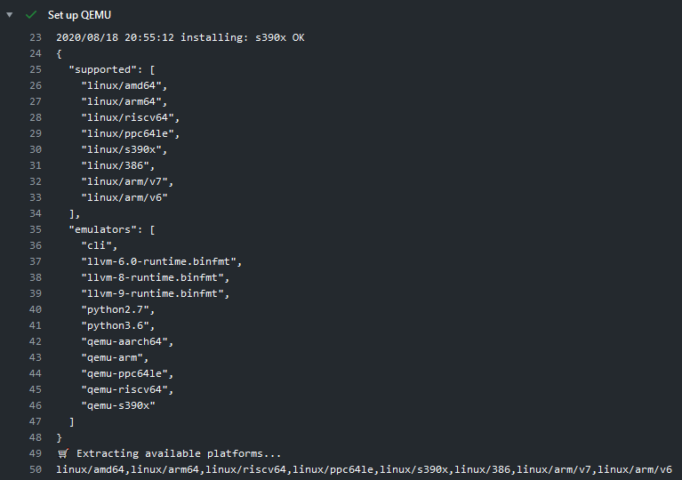

[](https://github.com/docker/setup-qemu-action/releases/latest)
[](https://github.com/marketplace/actions/docker-setup-qemu)
[](https://github.com/docker/setup-qemu-action/actions?workflow=ci)
[](https://github.com/docker/setup-qemu-action/actions?workflow=test)
[](https://codecov.io/gh/docker/setup-qemu-action)

## About

GitHub Action to install [QEMU](https://github.com/qemu/qemu) static binaries.



___

* [Usage](#usage)
* [Customizing](#customizing)
  * [inputs](#inputs)
  * [outputs](#outputs)
* [Contributing](#contributing)

## Usage

```yaml
name: ci

on:
  push:

jobs:
  qemu:
    runs-on: ubuntu-latest
    steps:
      -
        name: Set up QEMU
        uses: docker/setup-qemu-action@v3
```

> [!NOTE]
> If you are using [`docker/setup-buildx-action`](https://github.com/docker/setup-buildx-action),
> this action should come before it:
> 
> ```yaml
>     -
>       name: Set up QEMU
>       uses: docker/setup-qemu-action@v3
>     -
>       name: Set up Docker Buildx
>       uses: docker/setup-buildx-action@v3
> ```

## Customizing

### inputs

The following inputs can be used as `step.with` keys:

| Name          | Type   | Default                                                                       | Description                                        |
|---------------|--------|-------------------------------------------------------------------------------|----------------------------------------------------|
| `image`       | String | [`tonistiigi/binfmt:latest`](https://hub.docker.com/r/tonistiigi/binfmt/tags) | QEMU static binaries Docker image                  |
| `platforms`   | String | `all`                                                                         | Platforms to install (e.g., `arm64,riscv64,arm`)   |
| `cache-image` | Bool   | `true`                                                                        | Cache binfmt image to GitHub Actions cache backend |

### outputs

The following outputs are available:

| Name          | Type    | Description                           |
|---------------|---------|---------------------------------------|
| `platforms`   | String  | Available platforms (comma separated) |

## Contributing

Want to contribute? Awesome! You can find information about contributing to
this project in the [CONTRIBUTING.md](/.github/CONTRIBUTING.md)
